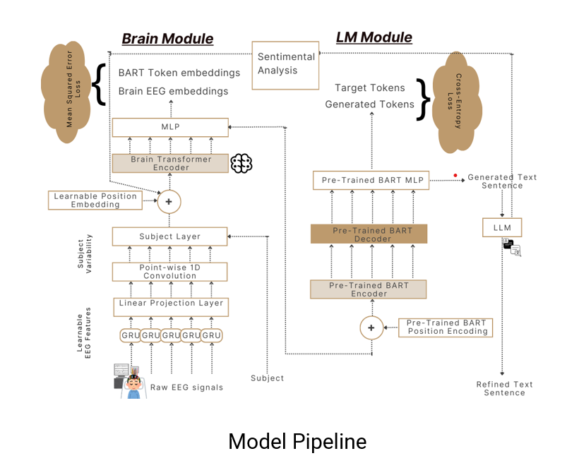

# 🧠 EEG-to-Text: Decoding Brain Activity into Natural Language

<div align="center">
  
  <h3 align="center">EEG-to-Text: Brain Signal Decoding using Deep Learning</h3>
  <p align="center">
    <b>Team Project | IIT Mandi</b><br/>
    <b>Mentor:</b> Jyoti Nigam
  </p>
</div>

---

## 🧠 Abstract

We developed an EEG-to-Text model that translates brain signals into natural language using deep learning architectures. Trained on the ZuCo dataset, our model combines GRUs, GANs, and BERT-based transformers with sentiment analysis to improve decoding quality.

The model achieved:
- **BLEU-1**: 42.75% (+1.40%)
- **ROUGE-1-F**: 33.28% (+2.59%)
- **BERTScore-F**: 53.86% (+3.20%)

Adding sentiment analysis boosted BERTScore and ROUGE by 1.02% and 0.56%, respectively, improving overall semantic consistency.

---

## 🚀 Key Features

- End-to-end EEG-to-Text decoding from raw signal
- Sentiment-augmented neural language modeling
- Trained on real EEG data from ZuCo v1.0 and v2.0
- Reproducible pipeline for preprocessing, training, and evaluation

---

## 🧠 Techniques Used

- GRU-based Sequence Modeling  
- GAN-enhanced EEG Signal Generation  
- Transformer Language Models (BERT)  
- Sentiment-Guided Decoding  
- BLEU, ROUGE, and BERTScore Evaluation  

---

## 🧪 Dataset

We use the publicly available [ZuCo Dataset](https://osf.io/q3zws/), which contains EEG recordings from 30 subjects engaged in natural reading tasks.

Folders:
```
/dataset/ZuCo/task1-SR/Matlab_files
/dataset/ZuCo/task2-NR/Matlab_files
/dataset/ZuCo/task3-TSR/Matlab_files
/dataset/ZuCo/task2-NR-2.0/Matlab_files
```

---

## 🏗️ Architecture

<div align="center">
  
</div>

---

## 📦 Getting Started

### 1. Download ZuCo Dataset

- ZuCo v1.0: Download 'Matlab files' for tasks SR, NR, TSR from [OSF v1.0](https://osf.io/q3zws/files/)  
- ZuCo v2.0: Download task NR from [OSF v2.0](https://osf.io/2urht/files/)  
- Extract `.mat` files into their corresponding folders.

---

### 2. Preprocess EEG Data

```bash
bash ./scripts/prepare_dataset_raw.sh
```

This script processes `.mat` files and generates `.pickle` datasets with sentiment labels.

---

### 3. Train Model

```bash
bash ./scripts/train_decoding_raw.sh
```

---

### 4. Evaluate Model

```bash
bash ./scripts/eval_decoding_raw.sh
```

---

## 📈 Results

| Metric        | Our Model | Previous SOTA | Improvement |
|---------------|-----------|---------------|-------------|
| BLEU-1        | 42.75%    | 41.35%        | +1.40%      |
| ROUGE-1-F     | 33.28%    | 30.69%        | +2.59%      |
| BERTScore-F   | 53.86%    | 50.66%        | +3.20%      |

With sentiment analysis:
- BERTScore-F ↑ **1.02%**
- ROUGE-1-F ↑ **0.56%**

---

## 👨‍💻 Team

- **Team Size**: 6  
- **Mentor**: Jyoti Nigam  
- Responsibilities:  
  - Signal preprocessing  
  - Deep learning architecture  
  - Sentiment analysis module  
  - Evaluation pipeline  

---

